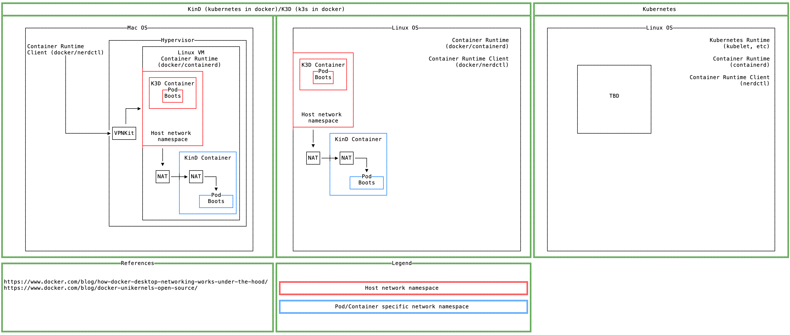

# Manifests

This directory contains the manifests for deploying Boots to various environments.

## KinD (Kubernetes in Docker)

### Prerequisites

- [KinD >= v0.12.0](https://kind.sigs.k8s.io/docs/user/quick-start#installation)
- [Kubectl >= v1.23.4](https://www.downloadkubernetes.com/)

### Steps

1. Create KinD cluster

   ```bash
   # Create the KinD cluster
   kind create cluster --config ./manifests/kind/config.yaml
   ```

2. Deploy Boots

   Start by updating `MIRROR_BASE_URL`, `PUBLIC_IP`, `PUBLIC_SYSLOG_FQDN`, and `TINKERBELL_GRPC_AUTHORITY` env variables in the `manifests/kustomize/base/deployment.yaml` file.

   ```bash
   # Deploy Boots to KinD
   kubectl kustomize manifests/kustomize/overlays/kind | kubectl apply -f -
   ```

3. Watch the logs

   ```bash
   kubectl -n tinkerbell logs -f -l app=tinkerbell-boots
   ```

> **Note:** KinD will not be able to listen for DHCP broadcast traffic. Using a DHCP relay is recommended.
>
> ```bash
> # Linux direct
> ipaddr=$(docker inspect -f '{{range .NetworkSettings.Networks}}{{.IPAddress}}{{end}}' kind-control-plane)
> sudo -E dhcrelay -id <interface to listen on for DHCP broadcast>  -iu $(ip -o route get ${ipaddr} | cut -d" " -f3) -d ${ipaddr}
>
> # Linux Container
> ipaddr=$(docker inspect -f '{{range .NetworkSettings.Networks}}{{.IPAddress}}{{end}}' kind-control-plane)
> docker run -d --network host --name dhcrelay modem7/dhcprelay:latest -id <interface to listen on for DHCP broadcast>  -iu $(ip -o route get ${ipaddr} | cut -d" " -f3) -d ${ipaddr}
>
> # MacOS TBD
> ```

## K3D (K3S in Docker)

### Prerequisites

- [K3D >= v5.4.1](https://k3d.io/v5.4.1/#installation)
- [Kubectl >= v1.23.4](https://www.downloadkubernetes.com/)
- Supported platforms: Linux

### Steps

1. Create K3D cluster

   ```bash
   # Create the K3D cluster
   k3d cluster create --network host --no-lb --k3s-arg "--disable=traefik"
   ```

2. Deploy Boots

   Start by updating `MIRROR_BASE_URL`, `PUBLIC_IP`, `PUBLIC_SYSLOG_FQDN`, and `TINKERBELL_GRPC_AUTHORITY` env variables in the `manifests/kustomize/base/deployment.yaml` file.

   ```bash
   # Deploy Boots to K3D
   kubectl kustomize manifests/kustomize/overlays/k3d | kubectl apply -f -
   ```

3. Watch the logs

   ```bash
   kubectl -n tinkerbell logs -f -l app=tinkerbell-boots
   ```

## Kubernetes

### Prerequisites

This deployment requires a running Kubernetes cluster. It can be a single node cluster. It is required to be running directly on a Linux machine, not in a container.
This deployment is under development and is not guaranteed to work at this time.

### Steps

1. Deploy Boots

   Start by updating `MIRROR_BASE_URL`, `PUBLIC_IP`, `PUBLIC_SYSLOG_FQDN`, and `TINKERBELL_GRPC_AUTHORITY` env variables in the `manifests/kustomize/base/deployment.yaml` file.

   ```bash
   # Deploy Boots to Kubernetes
   kubectl kustomize manifests/kustomize/overlays/dev | kubectl apply -f -
   ```

2. Watch the logs

   ```bash
   kubectl -n tinkerbell logs -f -l app=tinkerbell-boots
   ```

## Tilt

This deployment method is for quick local development.
Tilt will build and deploy Boots to the Kubernetes cluster pointed to in the current context of your Kubeernetes config file.

### Prerequisites

- [Tilt >= v0.28.1](https://docs.tilt.dev/install.html)
- Go >= 1.18
- [Kubectl >= v1.23.4](https://www.downloadkubernetes.com/)
- KinD cluster

### Steps

1. Deploy Boots

   Start by updating `MIRROR_BASE_URL`, `PUBLIC_IP`, `PUBLIC_SYSLOG_FQDN`, and `TINKERBELL_GRPC_AUTHORITY` env variables in the `manifests/kustomize/base/deployment.yaml` file.
   This deployment method uses the kustomize kind overlay. This can be updated in the `Tiltfile`.

   ```bash
   # Deploy Boots with Tilt
   tilt up --stream
   ```

2. Watch the logs

   ```bash
   kubectl -n tinkerbell logs -f -l app=tinkerbell-boots
   ```

## Notes

<details><summary>The following is a visual break down of the Boots deployment options.</summary>
<p>



</p>
</details>